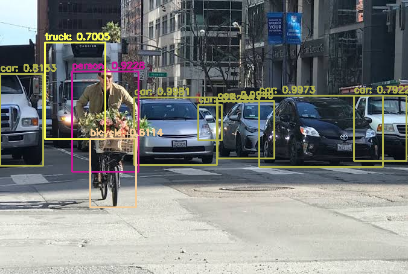

# object_detection
Basic application of object detection using YOLO/Faster_RCNN/SSD_MOBILENET implementations

Installation
====
#### Windows


Create conda environment with tensorflow installation 

##### GPU
``` 
conda create -n tf_env tensorflow-gpu
conda activate tf_env
```

##### CPU
conda create -n tf_env tensorflow
conda activate tf_env

Then install dependencies

```
pip install -r requirements.txt
```

#### Linux

```
pip install -r requirements.txt
```

Usage
====

## Tensorflow Object Detection API implementations of Faster_RCNN and SDD_MOBILENET

In order to run each of the models, follow these steps:

1. Trained models are included in the repo for easier testing.

2. For single image detection using Faster RCNN, run:

```
python app_detector_tf.py --input images/soccer.jpg --inf_input object_detector/models/faster_rcnn_inception_v2_coco_2018_01_28/
```

Which will yield the following result:


## Yolo object detector 

In order to run each of the models, follow these steps:

1. The coco trained weights for yolo:

[Yolo Weights](https://pjreddie.com/media/files/yolov3.weights)

2. yolov3.weights file to *yolo_detector/yolo-coco* directory

3. For single image detection using Yolo, run:

```
python app_detector_yolo.py --input images/soccer.jpg
```

Which will yield the following result:



## Video Detection

For detection in video any of the previous architecture can be selected. 

1. For SSD MOBILENET

```
python app_detector_video.py --input videos/airport.mp4 --arch ssd_mobilenet --inf_input object_detector/models/ssd_mobilenet_v2_coco_2018_03_29
```

2. For yolo

```
python app_detector_video.py --input videos/airport.mp4 --arch yolo
```

# FPS

Fps count is displayed on video frame window for each case. 

# Analysis
Further analysis regarding accuracy of detection wasn't made, except for visual impression of results. 
